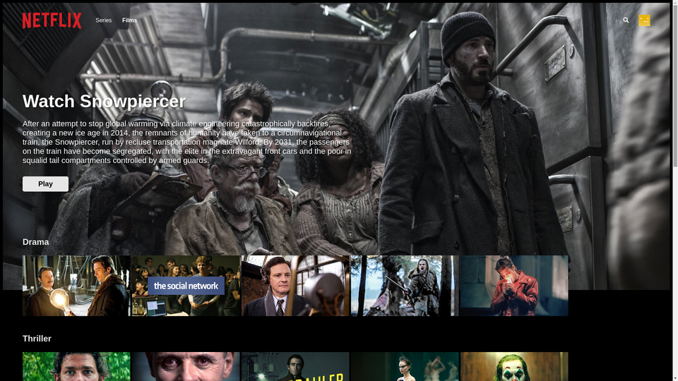

## Stack used:

-   ReactJS
-   React Styled Components
-   Firebase (Firestore & Auth)


## Installation

```cs
git clone https://github.com/VitalikPshytr/Pet-Netflix-Clone.git
```

To run it you must have Firebase account.
after the run you might want to comment that line `seedDatabase(firebase);` so it will not put same info twice on refresh.

## Usage

Finally download the dependencies and run the project

```cs
npm i
npm run
```

## Author

IURII LYTVYN

## License

[MIT](https://choosealicense.com/licenses/mit/)

## Screenshot


